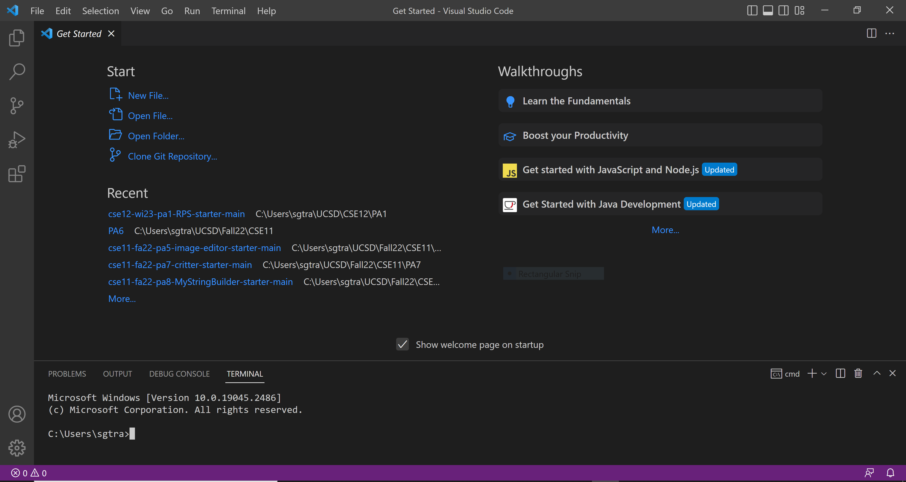
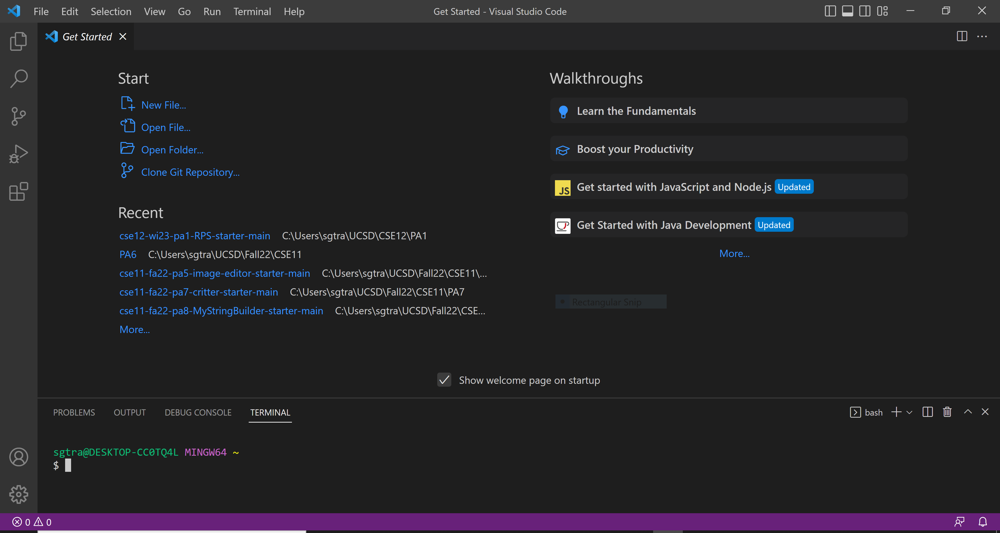
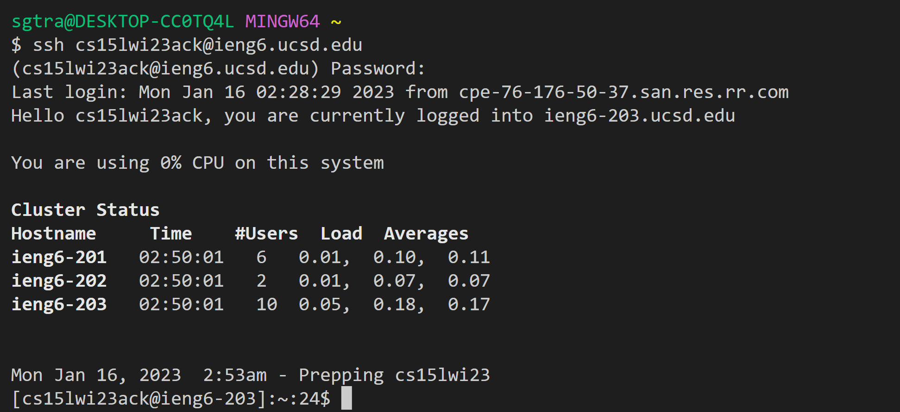
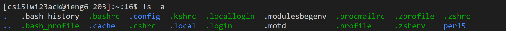
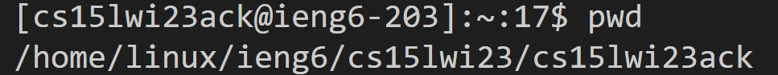
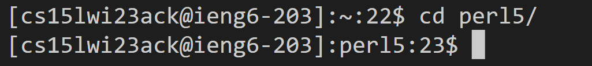
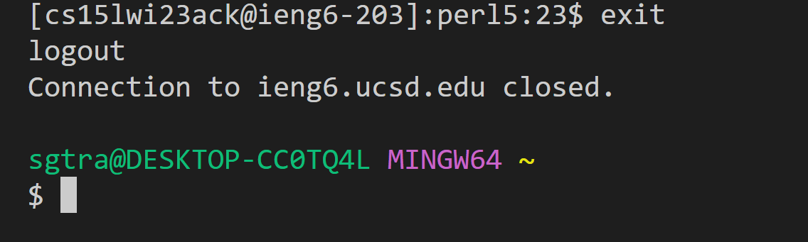

# Lab Report One
---
Author: Sean Tran 

PID: A16045509

Welcome to CSE15L!
Today we will be learning how to use remote access in three simple steps.
* Installing VSCode 
* Remotely Connecting
* Trying Some Commands

## Installing VS Code
* If VSCode is not already installed on your computer, go to this [link](https://code.visualstudio.com/)	to download and install VSCode version that corresponds with your operating system.
* Once VSCode is properly installed on your system open the application.
* Please note that it may be different color themes, menu bars, etc because of the variation of systems and settings available.
	

## Remotely Connecting
* If you are a Windows user, you need to download and install Git which can be found [here](https://gitforwindows.org/) and you will then also need to set your default terminal to Git Bash in VS Code using these [instructions](https://stackoverflow.com/a/50527994).
 	
* You will now go to your terminal and type in the command below replacing zz with the letters in your course specific account; answer yes to the prompt if it is your first time logging in and enter your password.
	
* You should get something like this you have succeded in logging in.
	

## Trying Some Commands
* Try some of these simple commands! 
* **ls -a** -> Lists all files in current directory including hidden ones
 
* **pwd** -> Prints the whole path of current directory from the root directory
 
* **cd [desired directory here]** -> Moves into desired directory 
 	
* In order to leave, either _press_ **Ctrl-D** or _type_ in **exit** into the terminal.
  	

