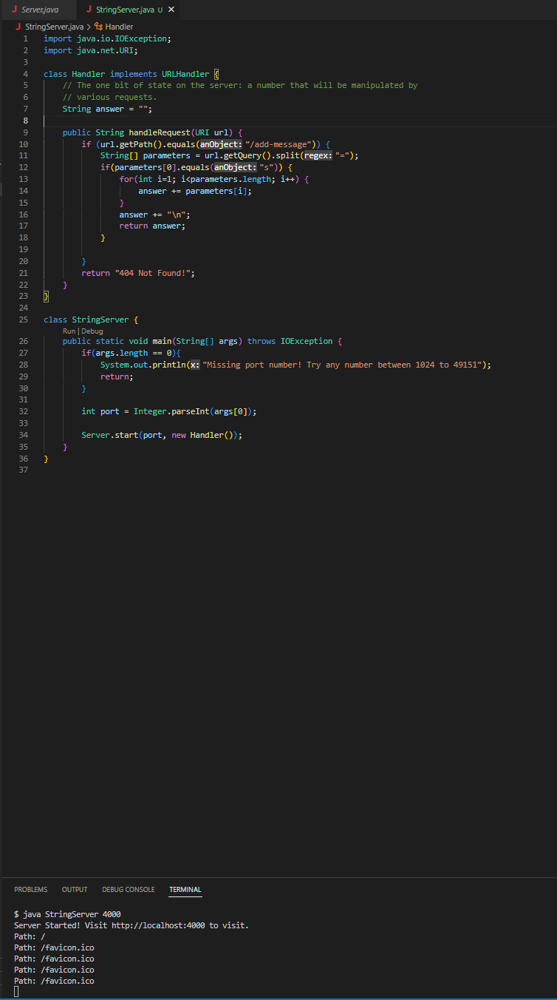
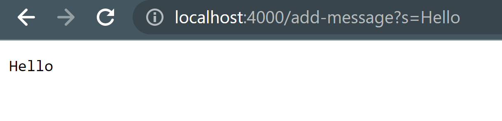
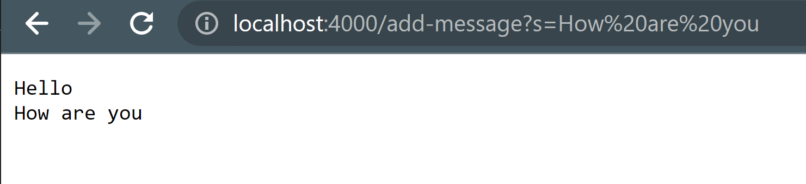

# Lab Report Two
---
Author: Sean Tran 

PID: A16045509

## Part 1 StringServer Webserver
* This is the code that runs String Server
* String Server takes in a request to display information on the page.
* Requests are kept track in a single string displayed on the page

