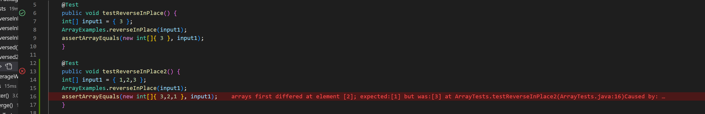
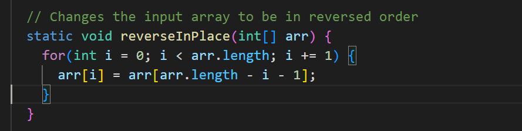
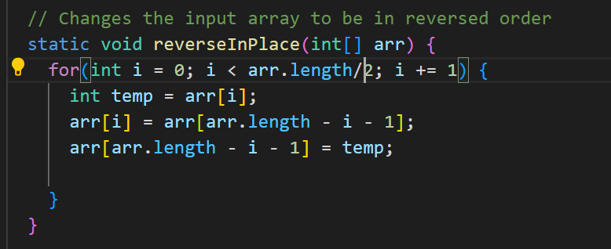

# Lab Report Two
---
Author: Sean Tran 

PID: A16045509

## Part 1 StringServer Webserver
* This is the code that runs String Server
* String Server takes in a request to display information on the page.
* Requests are kept track in a single string displayed on the page

* In the screenshot below, multiple methods were called to display the information shown
* The first method called was StringServer's main method that started the actually server. The method required one argument which was the port (I used port 4000.) The method checks if a port was given, if there was one then it will try to run the server on that port else it would give a missing port error. NOTE: this occured when we first started the server.
* The second method called was StringServer's handleRequest method that takes in a URI. It then parses the url path and checks if there was a proper request ("/add-message") and stores the information after the "=" into a string array called parameters. The method then parses through parameters and stores the String data into the answer string. The String answer is a instance variable so it lasts as long the server is running on that instance. Answer stores all the data in request. So as the user adds more requests, the requests are stored in answer and displayed on the page.

* In the screenshot below, the method StringServer's handleRequest method is run. This is done when the user edits the url from http://localhost:4000/add-message?s=Hello to http://localhost:4000/add-message?s=How are you. When this method is called, it parses the url to find the string data that occurs after the "=" and stores it in answer. Answer is then returned and displayed on the page with a new line.


## Part 2 Explaining a bug
* The code block below is an example of failure-inducing input for the reverseInPlace method
```java
{
   	@Test 
	public void testReverseInPlace2() {
   	int[] input1 = { 1,2,3 };
   	ArrayExamples.reverseInPlace(input1);
  	 assertArrayEquals(new int[]{ 3,2,1 }, input1);
	}
}
```

* The code block below is an example of non-failure-inducing input for the reverseInPlace method
```java 
{
	@Test 
	public void testReverseInPlace() {
    	int[] input1 = { 3 };
    	ArrayExamples.reverseInPlace(input1);
    	assertArrayEquals(new int[]{ 3 }, input1);
	}
}
```
* This is the symptom as the output of running the tests described above. The symptom for the out of the test fail was last element should have been 3 but was 1.

* The bug was the loop iterated through the array and only swapped one side of the array. For example, to reverse an array, we would swap the first and last element. However, the code only swapped the first element with the last element without ever changing the last element.

* The fix was to store the value of the arr element in temp before replacing it with the value of the corresponding element on other side of the array. Then we update the opposite corresponding element in the array. Also the amount of iterations was cut to only half the array becuase you only need to access half the elements since you are changing the element in the position and its opposite correspoding element. 
 

## Part 3 Reflection
* Something from lab that I learned in week 2 that I did not know before was how to run a server. I used to think running a server required a giant specialized machine that would need the ability to process a lot more data than even my computer can handle. I realized that it really only took a few lines of code in VSCode for me to run a simple server. I understand for more complex operations I may need a stronger machine to operate a server. However, running a simple server like the one we used in class is really simple. All we need a simple server class and a url handler to parse data and handle operations like adding, storing data, and other simple operations.
