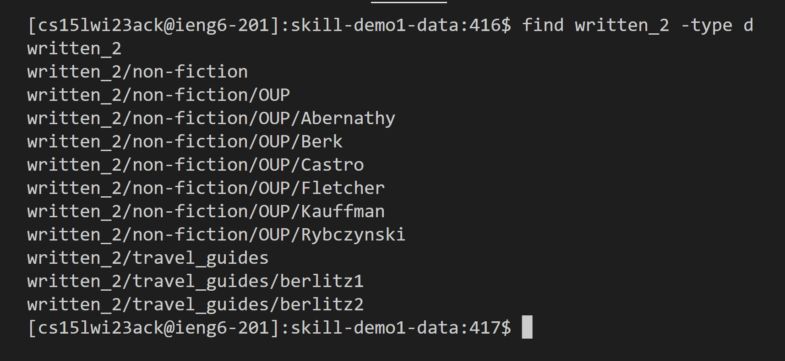
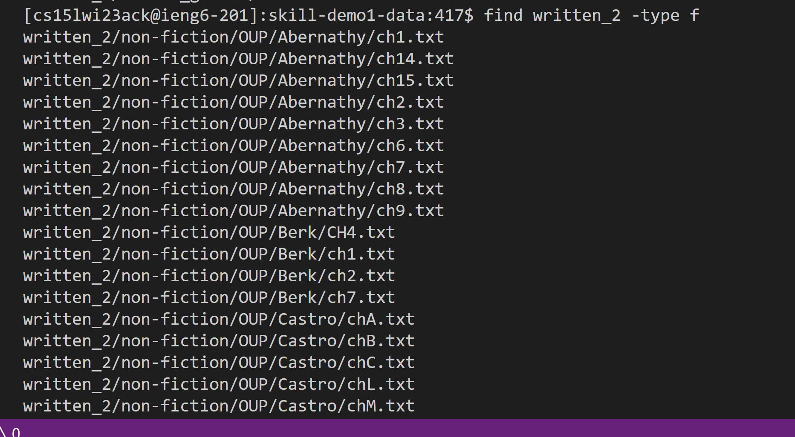
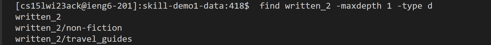
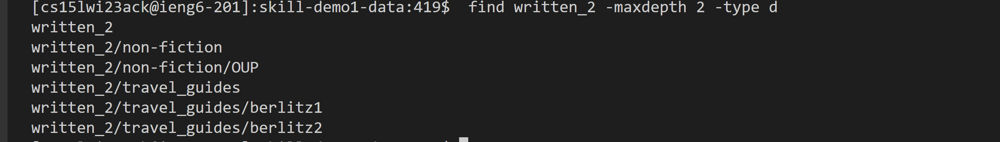
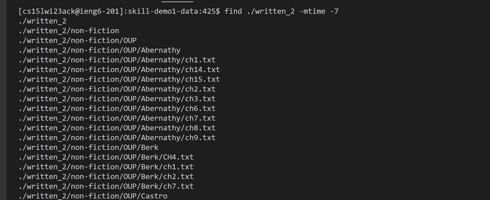
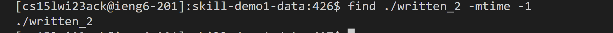
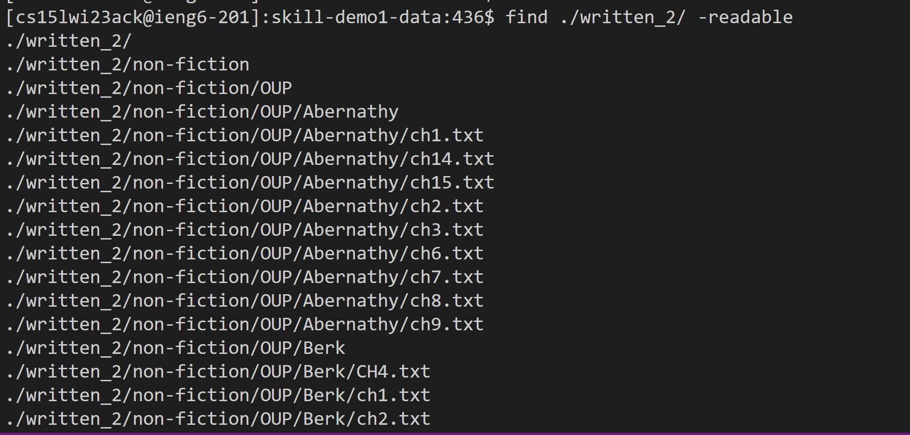
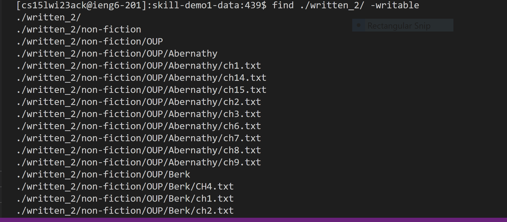

# Lab Report Three 
---
Author: Sean Tran 

PID: A16045509

## Researching Commands
* I chose to explore _find_ for additional command line options.
 
***find ./written_2/ -[PERMISSION]***
* This searches the entire written_2 directory and all files you have permission to do a specific action.
* This option may be useful for when you want to edit multiple files but need to know which files you have a specific permission for. You may also use this option to verify the permissions for the files are correct. 
* The first example shows us searching for all files we can read.

* The second example shows us searching for all files we can write. 

**find written_2 -type [FILE TYPE]**
* This command allows you to specify type of file you are looking for.
* This option may be useful for when you want to manipulate files of a certain file type within a repository. You can also use the option for when you want to move files for a certain file type and want to see which of those files exist in the repository.
* The first example shows us searching for all directories in written_2

* The second example shows us searhing for all files in written_2

**find written_2 -maxdepth [DEPTH NUMBER] -type d**
* This command allows you to limit the depth of directories displayed from given directory.
* This option may be useful for when you want to view only a certain depth of a large repository. By limiting how deep you search a repository it makes it easier to see specific files instead of being flooded with all files in the repository.  
* The first example limits the depth to one level.

* The second example limits the depth to two level.

**find ./written_2 -mtime -[TIME]**
* This command allows you to find all the files and directories that were last modified in n given days.
* This option may be useful when you want to verify work done in specific files and double check the edited files. You can also make use of this option to see if any new malicous files were added to the repository so you can remove them.
* The first example limits max last time edit to 7 days.

* The second example limits the max last time edit to 1 day.

* Sources: **man find** command in terminal and https://www.redhat.com/sysadmin/linux-find-command
