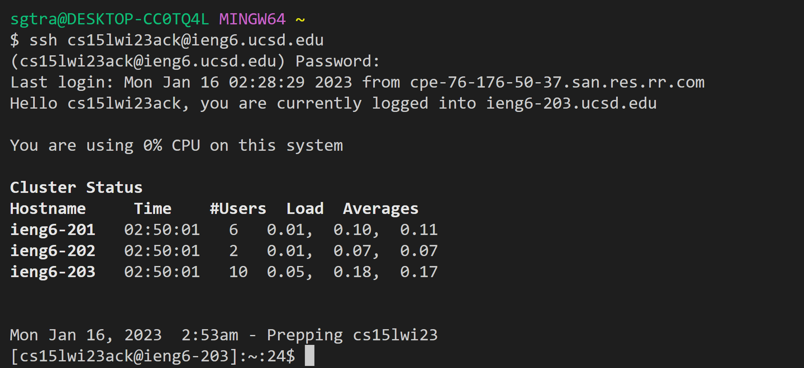
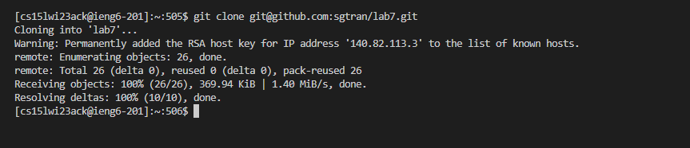
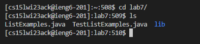
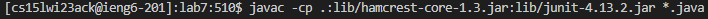
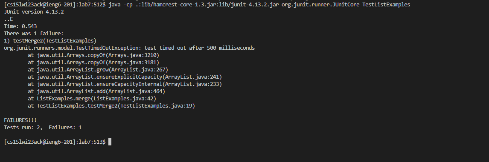
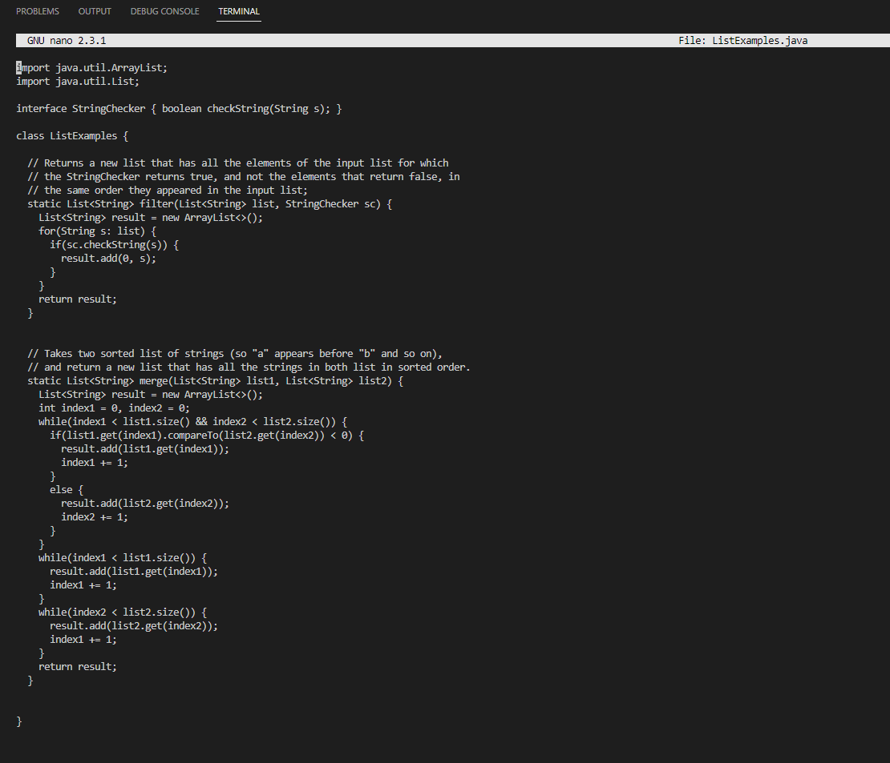
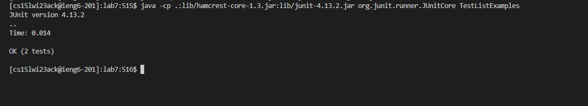
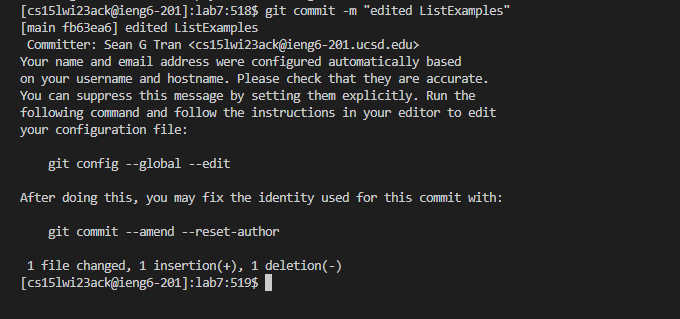
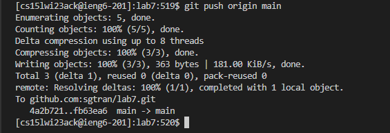

# Lab Report Four 
---
Author: Sean Tran 

PID: A16045509

## Competition Steps
* This lab will go over in depth how to perform the competition steps.
 
***Log into ieng6***
* Open VSCode and ssh with username and enter your password.
	
* Once you log in, it should look like this.

* If you have ssh key in ieng then you should not have gotten a password prompt and got loggged in like this.

***Clone your fork of the repository from your Github account***
* Type in the following line of code into terminal and press enter the following command:

<code>git clone [ssh link from forked repo] &lt;enter&gt;</code>

* This command cloned the forked repository from github.
* It should look like this:

***Run the tests, demonstrating that they fail***

 The _first_ step you need to do is cd in the lab7 directory by running the following command:
 
<code>cd lab7/  &lt;enter&gt;</code>
 
* This command put you into the lab7 directory.
* It should look like this:
 

The _second_ step is to compile junit tests by running following command:
 
<code> javac -cp .:lib/hamcrest-core-1.3.jar:lib/junit-4.13.2.jar *.java  &lt;enter&gt;</code>

* This command compiled the java and junit files.
* It should look like this:

The _third_ step is to run tests by running the following command:
 
<code> java -cp .:lib/hamcrest-core-1.3.jar:lib/junit-4.13.2.jar org.junit.runner.JUnitCore TestListExamples  &lt;enter&gt;</code>

* This command ran the junit tests.
* It should look like this:

***Edit the code file to fix the failing test***

Enter the file to edit code by running following command:
 
<code> nano ListExamples.java  &lt;enter&gt;</code>
 
* This command opened a the file for you to edit in terminal.
* It should look like this:

 
* The bug to fix is to fix the index incremention in the third while loop from index1 to index2
* Complete the following sequence in order
press &lt;down&gt 42 times
press &lt;right&gt 12 times
press &lt;backspace&gt 1 time
type 2
ctr x
type y
press &lt;enter&gt

* This allowed you to fix the bug and save the file.
 
***Run the tests, demonstrating that they now succeed***

The _first_ step is to compile junit tests by running following command:
 
<code> javac -cp .:lib/hamcrest-core-1.3.jar:lib/junit-4.13.2.jar *.java  &lt;enter&gt;</code>

* This command compiled the java and junit files.
* It should look like this:

 
The _second_ step is to run junit tests by running following command:
 
<code> java -cp .:lib/hamcrest-core-1.3.jar:lib/junit-4.13.2.jar org.junit.runner.JUnitCore TestListExamples  &lt;enter&gt;</code>

* This command ran the junit testing file.
* It should look like this with 2 passing tests:

***Commit and push the resulting change to your Github account (you can pick any commit message!)***

The _first_ step is to add edited file by running following command:
 
<code> git add ListExamples.java  &lt;enter&gt;</code>
 
* This command added the edited file. 
* It should look like this:
 
 
The _second_ step is to commit added edited file by running following command:
 
<code> git commit -m "[COMMIT MESSAGE]"  &lt;enter&gt;</code>
 
* This command commited the file with a message in a commit 
* It should look like this:
 
 
The _third_ step is to push added edited file by running following command:
 
<code> git push origin main  &lt;enter&gt;</code>
 
* This command pushed the commit to GitHub
* It should look like this:
 

