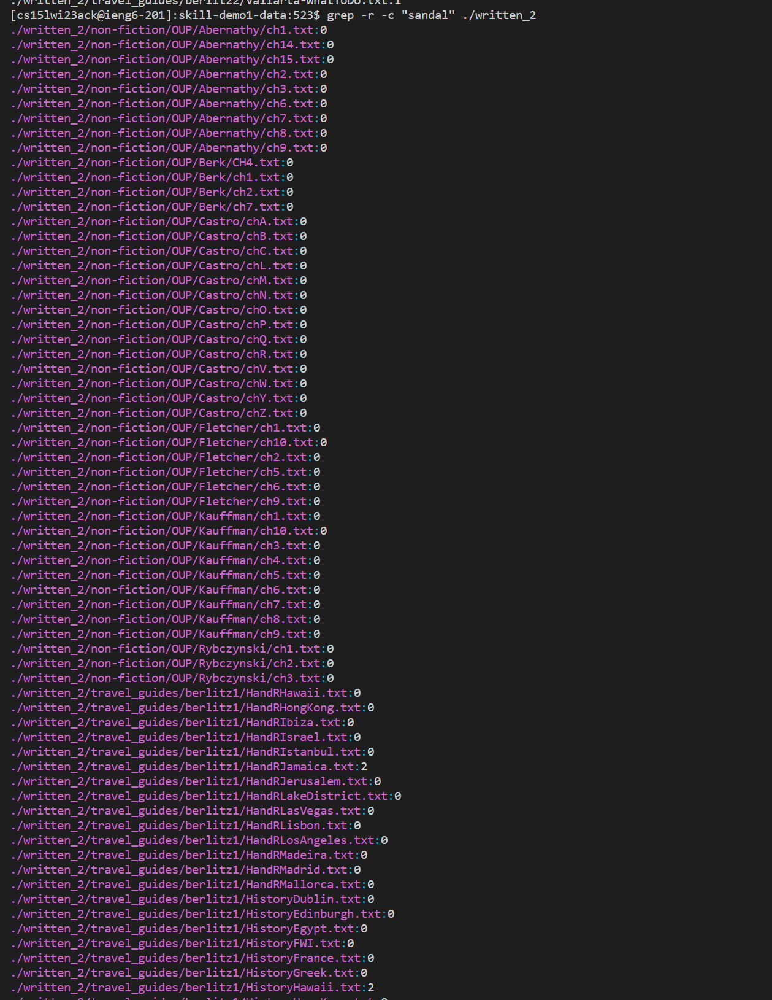
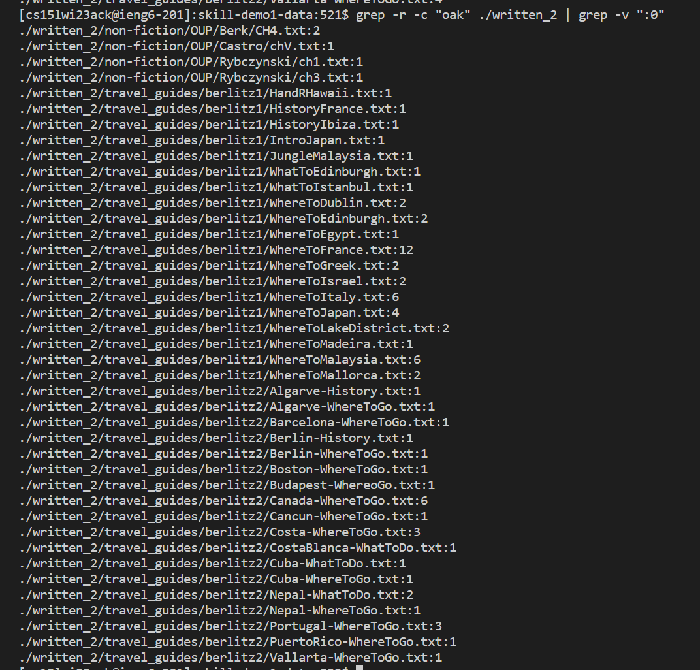
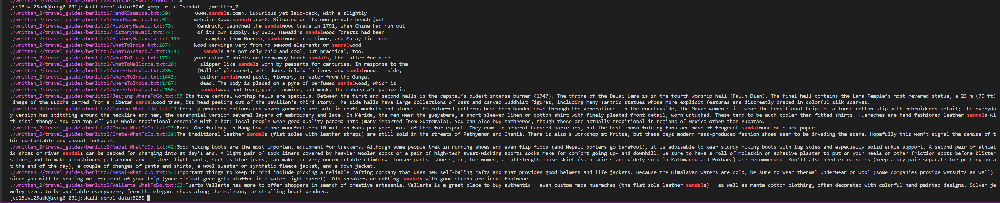
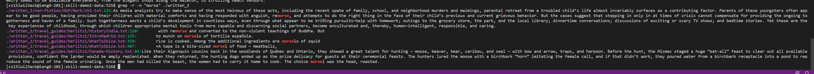
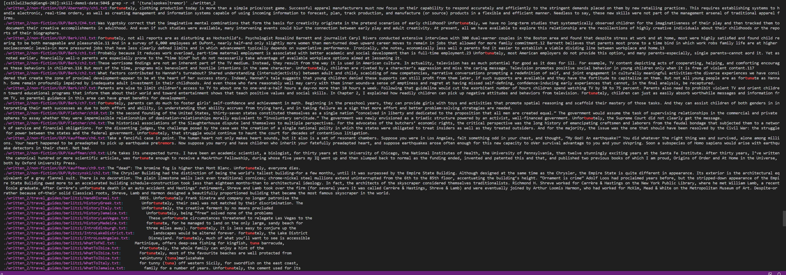
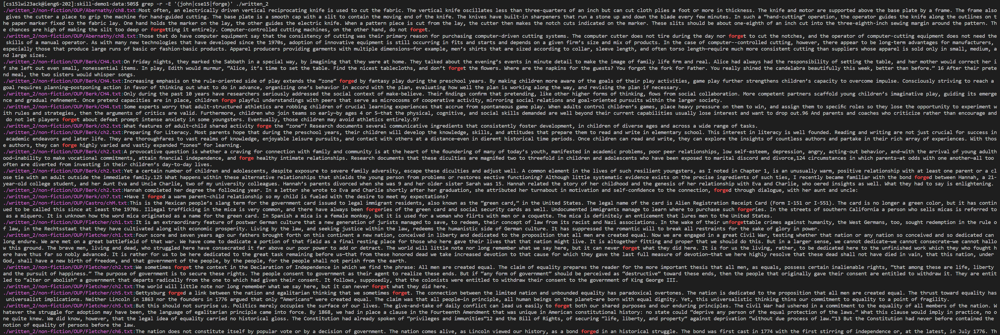

# Lab Report Five 
---
Author: Sean Tran 

PID: A16045509

## Researching Commands
* I chose to explore _grep_ for additional command line options.

***grep -r -c "[ANY STRING]" ./written_2***
* This command recursively searches all of written_2 directory and finds how many occurances of a given string occur in each file.
* This option may be useful for when you are looking for how many times a word occurs in a entire directory. You may also use this option to find all the files that contain language you want to change.
* This first example shows us how many occurances of "sandal" are in each file. 

* The second example adds an extra command ***| grep -v ":0*** to omit all lines of output that have zero occurances so it filters the output to only show the files that have atleast one occurance of the word "oak".

***grep -r -n "[ANY STRING]" ./written_2***
* This command recursively searches all of written_2 and prints each line that contains a given string for each file. 
* This option may be useful for when you want to know how a certain word is being used in every file in a directory. This may also be useful if you want to see the purpose of each word is in each file by reading the sentence it is used in. 
* This first example shows us how many occurrances of "sandal" being used in a line in each file in written_2 directory. 

* This first example shows us how many occurrances of "morse" being used in a line in each file in written_2 directory. 

 
 ***grep -r -E "([word]|[word]...)" ./written_2***
* This command recursively searches all of written_2 for different patterns and outputs the line in each file that contain any of the given patterns. The '-E' allows for extended regular expressions which allows you to use the ***|(or)*** operator to look for multiple patterns in the same search.
* This option may be useful for when you want to search for the usages of different words in a directory of files. This option may also be useful for when you want to remove all files that contain certain key words. 
* This first example shows us how many occurrances of "tuna", "spokes", and "tremor" being used in a line in each file in written_2 directory. 

* This first example shows us how many occurrances of "john", "cse15l", and "forge" being used in a line in each file in written_2 directory. 

 Sources: https://qpeng.org/computer/grep.htm#:~:text=The%20%2Dc%20option%20tells%20grep,of%20%22boo%22%20in%20a_file.&text=An%20option%20more%20useful%20for,is%20%2Di%2C%20ignore%20case. && **man grep** command
 
